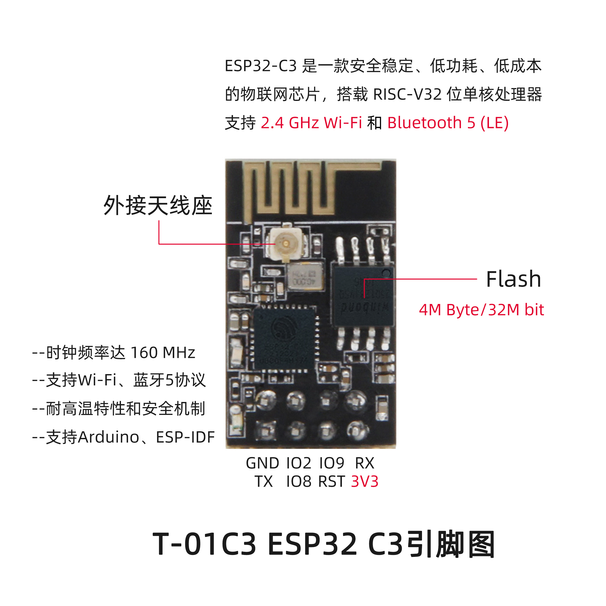

<h1 align = "center">🌟LILYGO T-01C3🌟</h1>

## **[English](./README.MD) | [中文](./README_CN.MD)**

<h3 align = "left">Quick start:</h3>

1. 安装 Arduino IDE  [Arduino website](http://www.arduino.cc/en/main/software).
2. 打开Arduino，打开“文件” ->“首选项”，附加开发板管理器的url添加: https://raw.githubusercontent.com/espressif/arduino-esp32/gh-pages/package_esp32_index.json 
3. 选择“工具” -> 开发板选择 -> ESP32C3 Dev Module

<h3 align = "left">Product 📷:</h3>

| Product |                         Product  Link                         |
| :-----: | :-----------------------------------------------------------: |
| T-01C3  | [淘宝](https://www.aliexpress.com/item/1005003538055090.html) |

## Pinout

